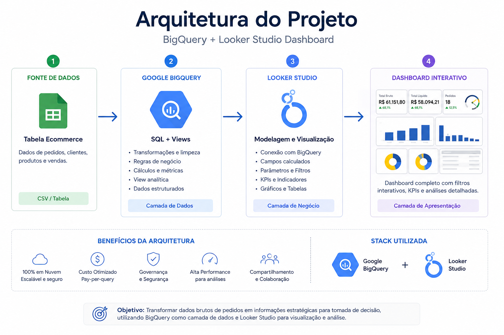
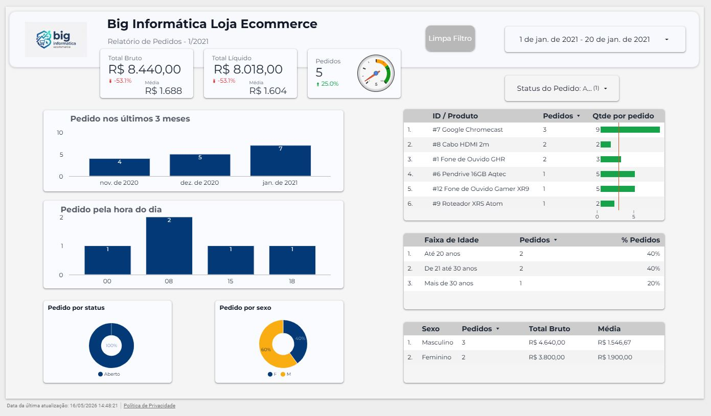
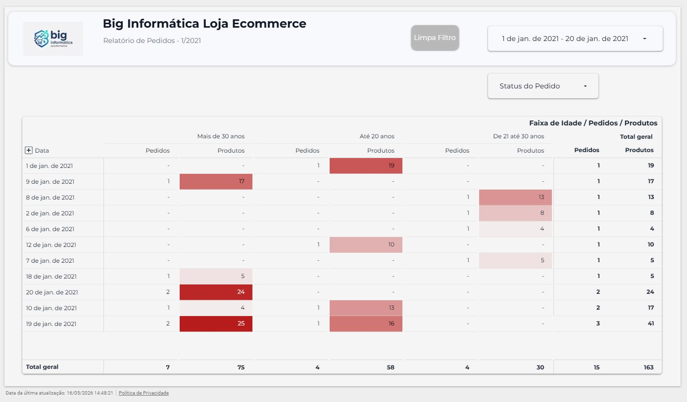
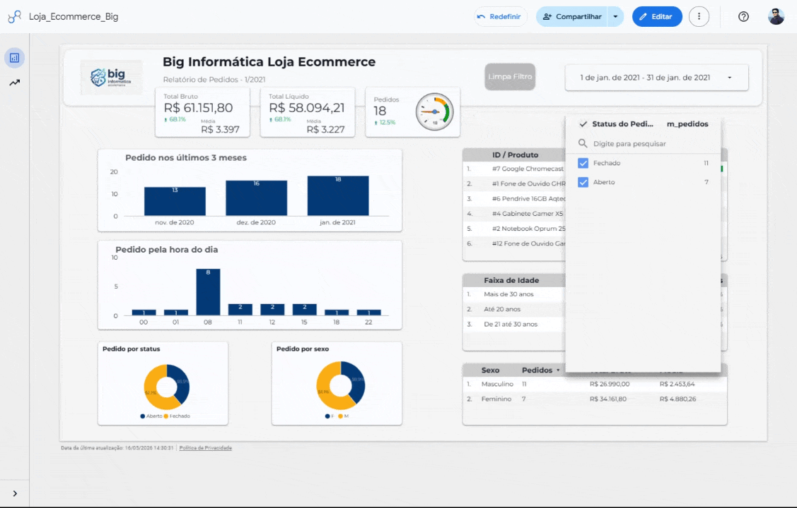

# 🚀 Looker Studio + BigQuery Dashboard

Modern Business Intelligence project using Google BigQuery and Looker Studio.

---

# 📌 Project Overview

This project demonstrates a complete cloud-based Business Intelligence solution using:

- Google BigQuery
- Looker Studio
- SQL
- Calculated Fields
- Interactive Dashboards

The goal was to create a professional dashboard experience as a modern alternative to traditional desktop BI tools.

---

# ☁️ Technologies Used

| Technology | Purpose |
|---|---|
| BigQuery | Cloud Data Warehouse |
| Looker Studio | Data Visualization |
| SQL | Data Transformation |
| Google Cloud Platform | Cloud Infrastructure |

---

# 🏗️ Architecture



---

# 📊 Dashboard Preview

## Executive Dashboard


---


---

# 🎥 Interactive Dashboard



---

# 📈 Business Metrics

The dashboard includes:

- Total Revenue
- Net Revenue
- Orders
- Revenue by Gender
- Revenue by Status
- Orders by Hour
- Orders by Product
- Age Group Analysis
- Interactive Filters

---

# 🧠 BigQuery SQL Features

Examples implemented in BigQuery:

- CREATE VIEW
- CASE WHEN
- DATE Functions
- Business Rules
- Aggregations
- Data Preparation

Example:

```sql
CASE
    WHEN sexo_cliente = 'M' THEN 'Masculino'
    ELSE 'Feminino'
END AS sexo_extenso
```

---

# 📌 Looker Studio Features

Calculated fields created inside Looker Studio:

- Age Groups
- Month/Year Formatting
- KPI Metrics
- Percentage Calculations
- Interactive Filters

Example:

```sql
CASE
    WHEN idade_cliente <= 20 THEN 'Até 20 anos'
    WHEN idade_cliente > 20 AND idade_cliente <= 30 THEN 'De 21 até 30 anos'
    ELSE 'Mais de 30 anos'
END
```

---

# 🎨 Dashboard Design

Project focused on:

- Professional layout
- Cloud-native analytics
- Modern BI concepts
- Interactive user experience
- Executive dashboard style

---

# 📂 Project Structure

```text
assets/         -> GIFs and architecture images
docs/           -> Documentation
screenshots/    -> Dashboard screenshots
sql/            -> SQL scripts
```

---

# 🔗 BigQuery + Looker Studio Integration

This project demonstrates how to integrate:

- BigQuery Views
- SQL transformations
- Cloud dashboards
- Interactive analytics

using a fully online environment.

---

# 📌 Author

Antonio Estevao

LinkedIn:
(add your LinkedIn here)

GitHub:
https://github.com/aestevaomoraes
